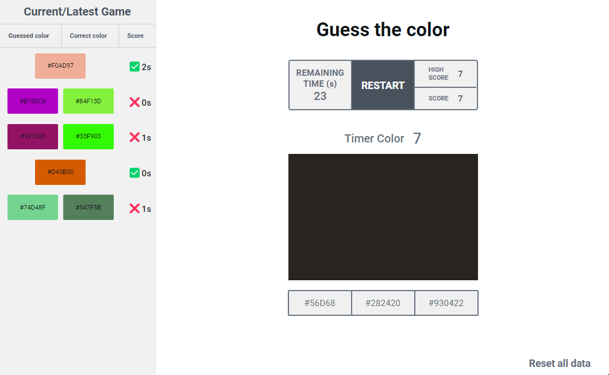

<h1>
    Quiz Color
</h1>

A aplicação Quiz Color que foi implementada, que visa praticar a invejável habilidade daqueles que conseguem visualizar uma cor,
apenas olhando para seu hexadecimal. Sim essas pessoas existem, acredite.

## 🎨 Layout

    

---

## Como o jogo funciona?
O jogo consiste em acertar o máximo possível de cores em 30s. Quando o jogo inicia, 
uma cor aleatória irá aparecer e para ela deverão aparecer 3 opções de resposta (obrigatoriamente em hexadecimal).
Sendo duas incorretas (geradas aleatoriamente), e uma correta.
A cada rodada, uma nova cor aparece, e o jogador terá 10s para responder e resultar em ganho ou perda de pontuação:
- Se o jogador não responder a tempo, ele perde 2 pontos.
- Se o jogador responder a tempo, mas errado, perderá 1 ponto.
- Se o jogador responder a tempo e corretamente, ganhará 5 pontos.

## 🚀 Technologies

Esse projeto foi desenvolvido com as seguintes tecnologias:

✔ [Vite](https://vitejs.dev/)
 
✔ [ReactJS](https://reactjs.org/)
 
✔ [CSS Pure](https://developer.mozilla.org/pt-BR/docs/Web/CSS)
 

## ⚙ Settings

Segue os comandos para baixar e executar o projeto na sua máquina:

* `git clone` + `URL do Projeto`: clonar este repositório.
* `npm install`: para baixar as dependências do projeto dentro do diretório.
* `npm run dev`: 
    - Executa o projeto em modo/ambiente de desenvolvimento.
    - Abra [http://localhost:5173/](http://localhost:5173/) para ver o projeto rodando no Navegador.
    - A página será recarregada se você fizer edições no código, e se tiver algum erro será mostrado no console.

